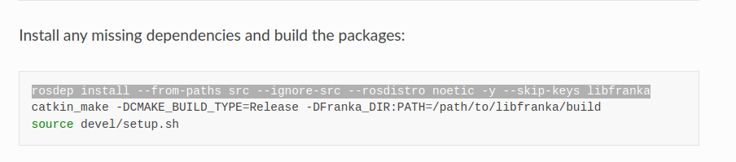
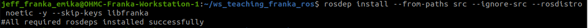
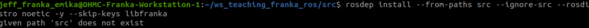
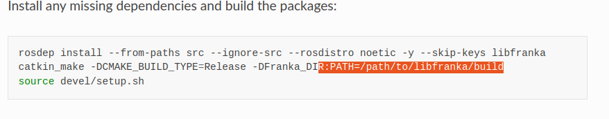
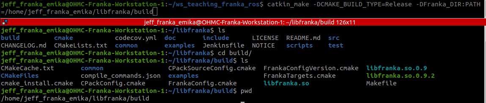
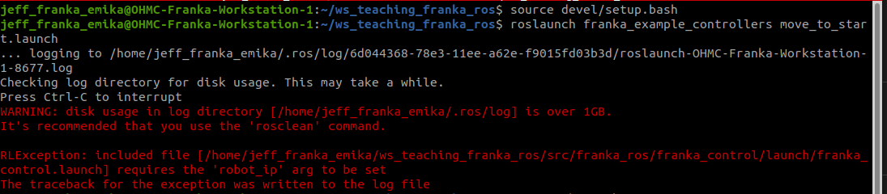
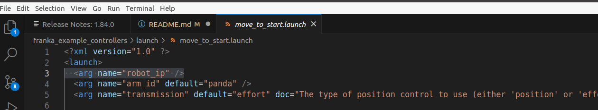
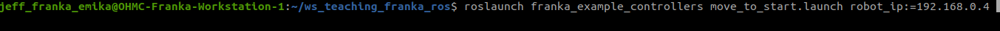

# ROS integration for Franka Emika research robots

See the [Franka Control Interface (FCI) documentation][fci-docs] for more information.

## License

All packages of `franka_ros` are licensed under the [Apache 2.0 license][apache-2.0].

[apache-2.0]: https://www.apache.org/licenses/LICENSE-2.0.html
[fci-docs]: https://frankaemika.github.io/docs

## Install
### note 1

The highlight line of code should be executed in the directory of workspace e.g.:
/home/jeff_franka_emika/ws_teaching_franka_ros

If you paste and run this code in the directory of ws_teaching_franka_ros/src, then you will get this error:

### note 2

For the highlight part, needs to replace it with the actual path of the libfranka/build
The correct command in this setup will be 

## running the first script!

This error means we need to setup the robot ip!

Open the launch file, find that we need to specify ip

So the correct way should be:

